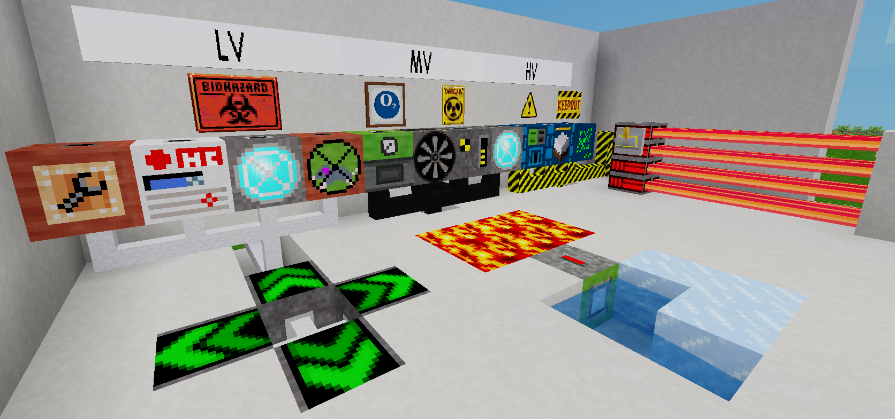

# technic more machines
> Technic More Machines Mod for Minetest

This is an addon for Technic Mod

mod contains:

LV machines

- Tubelib Repairer - repairs all tubelib devices within a radius of 10 blocks
- Health Charger - improves your health when you click
- Spotlight - emits a beam of light for 50 blocks
- Rat Wheel Generator - generates 100 EU
- Blink Teleporter - teleports you to the designated direction for 100 blocks

MV machines

- Distiller - converts sugar into ethanol
- Oxigen Generator - creates oxygen
- Radioisotope Thermoelectric Generator - caution, radiation! generates 900 EU, electricity production decreases over time
- Spotlight - emits a beam of light for 50 blocks
- Geothermal Generator - collects heat and cold from a larger area, also uses ice and snow, 2000 EU maximum

HV machines

- Furnace - only for metals, processes lump or dust directly into metal blocks
- Terraformer - converts the surrounding terrain to the specified type, right click to configure
- Transmutator - converts metal blocks into metal blocks with lower atomic mass, ratio 2 to 1
- Laser Emitter - creates a laser beam that deals great damage, use mesecon signal to turn on

the mod also contains several warning signs

## License
WTFPL
